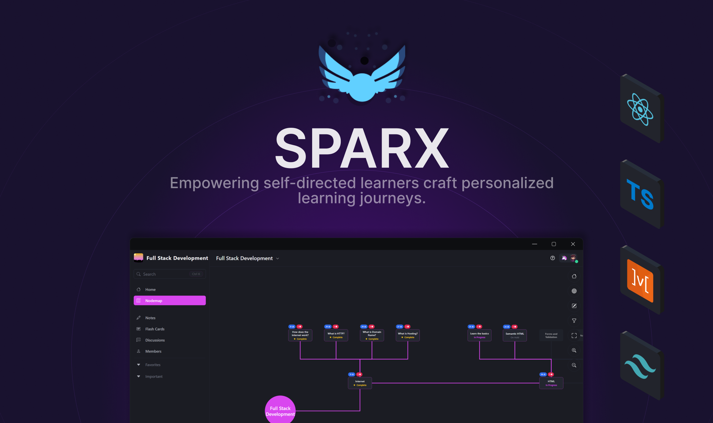
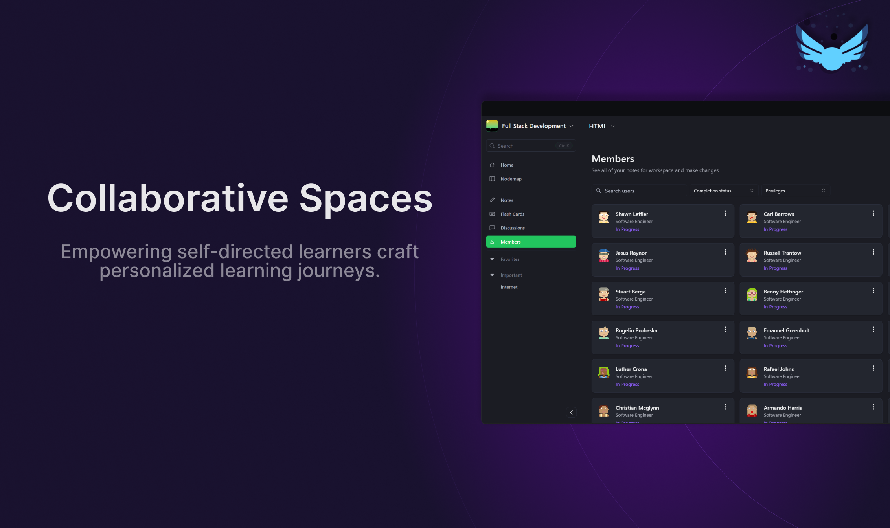

  

Transforming solo and collaborative learning with customizable roadmaps, interactive resources, and community-driven knowledge sharing.

<h3>Introduction</h3>

Navinotes is a learning platform where users create personalized roadmaps, share educational content, and track progress in a collaborative community, simplifying and enriching the learning experience.

<h3>Features</h3>

<h3>Usage</h3>

To get started with Sparx, the hosted version of the product can be used. You can get started immediately at spa-rx.ca. To demo the application, click the "Sign in Anonymously" button. The website provides an overview of the application and a guided tour.

